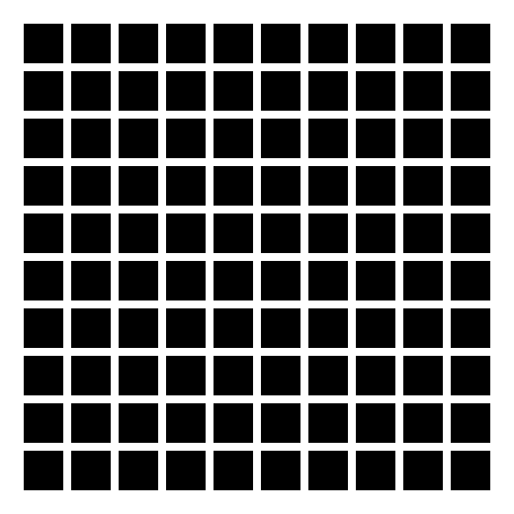

# Hermann grid

Check out https://chrplr.github.io/hermann_grid/

<christophe@pallier.org>

Implementation of the [Hermann grid illusion](https://en.wikipedia.org/wiki/Grid_illusion) in C using [Simple DirectMedia Layer (SDL)](http://libsdl.org).

## Usage

A Linux executable (`builds/linux/grid`), compiled under Ubuntu 20.04, is provided. 

It assumes that SDL2 from libsdl is installed. 

* Under Ubuntu:

        sudo apt install libsdl2-2.0-0 
        
* Under Fedora:

         sudo dnf install SDL2

    
Note: ther sdl2 libraries are also worth installing. 

* Ubuntu:

        sudo apt install libsdl2-gfx-1.0-0 libsdl2-image-2.0-0 libsdl2-mixer-2.0-0 libsdl2-net-2.0-0 libsdl2-ttf-2.0-0

* Fedora: 

        sudo dnf install SDL2_image SDL2_image-devel SDL2_ttf SDL2_ttf-devel

When the program is running, use the four arrow keys to modify the squares' width and the gap between them, and the 's' key to save a screenshot of the content of the current window.

## Compilation

### Linux

1. Install SDL2 development library. You can do from the source code, following the instructions at <https://wiki.libsdl.org/Installation>, or from your distribution package manager, e.g.:

 * For Ubuntu:

        sudo apt install libsdl2-dev
        
 * For Fedora:

        sudo dnf install SDL2 SDL2-devel

2. Compile 

        ./configure --prefix=$HOME && make && make install

### MacOSX

1. install [homebrew](https://brew.sh/)
2. install sdl2

        brew install sdl2
        
3. Compile

        ./configure prefix=$HOME && make && make install

### Windows

1. Install the mingw-w64 C compiler and the development version of SDL2, following the instructions at  <https://www.matsson.com/prog/sdl2-mingw-w64-tutorial.php>

2. 3. Compile

        ./configure prefix=$HOME && make && make install

## Development 

### TODO

* Add some help text at the bottom of the windows that explains what 
keys can be pressed (even better: "Press 'h' for help" and display the keybindings in the windows.

* Add cross compilation to target Windows.

